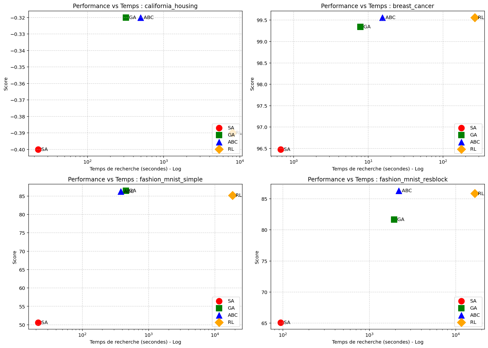
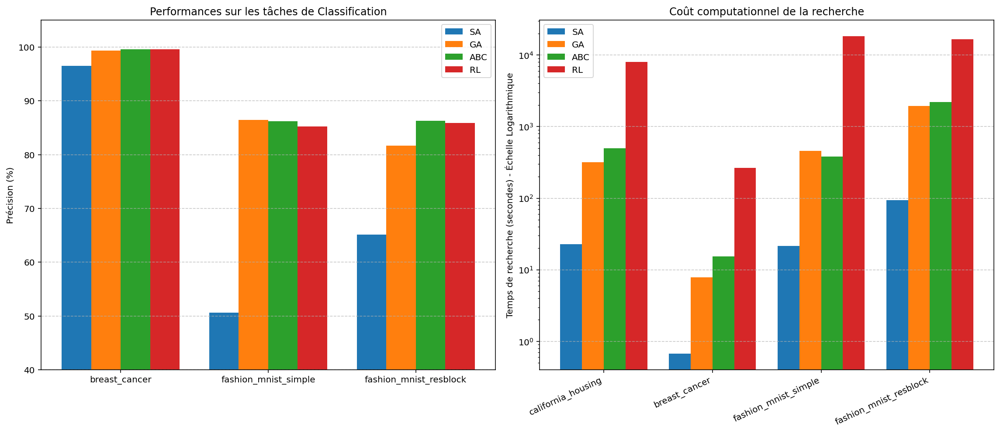

# Neural Architecture Search

## Abstract

algorithme qui cherche une architecture de réseaux de neurones optimisée de façon autonome

### 3 composantes

-Search Space : Quelles architectures sont possibles ? (ex: CNN, Transformers, GNN).

-Search Strategy : Comment explorer cet espace ? (ex: Algorithmes évolutionnaires, RL, Gradient).

-Performance Estimation Strategy : Comment évaluer si une architecture est bonne sans l'entraîner pendant des jours ?

## SOTA

### One-Shot NAS et Weight Sharing

entraine un grand modèle contenant plusieurs arch possibles


### D-NAS

utilise GD pour optimiser hyperparam. Peu robuste mais upgrade avec DrNAS & RobustDARTS

### Zero-Cost Proxies

Etimer la perf d'un réseaux sans training avec corrélation synaptique (SynFlow) ou matrice d'information de Fisher

### Hardware-Aware NAS

cherche meilleur réseau selon des critères

---

### Comparatif des Approches

| Approche | Vitesse de recherche | Précision | Complexité de mise en œuvre | Cas d'usage idéal |
| :--- | :--- | :--- | :--- | :--- |
| **Reinforcement Learning** (Old School) | Très lente | Très élevée | Moyenne | Recherche fondamentale, Google-scale compute |
| **Differentiable (DARTS)** | Rapide | Élevée (si stable) | Élevée | Vision par ordinateur standard |
| **One-Shot / Weight Sharing** | Très Rapide | Élevée | Très Élevée | Production, Edge AI, Mobile |
| **Zero-Cost Proxies** | Instantanée | Moyenne/Bonne | Faible | Filtrage initial massif |

---

## algorithmes

* **Once-for-All (OFA)** : Basé sur le One-Shot. On entraîne un grand réseau une seule fois, puis on extrait des sous-réseaux optimisés pour n'importe quel device.
* **Zero-Cost Proxies (SynFlow)** : Méthode de scoring instantané pour évaluer le potentiel d'un réseau sans entraînement.
* **Differentiable NAS (DARTS)** : Optimisation continue de l'architecture via gradient.
* **Algorithmes Évolutionnaires (AmoebaNet)** : Utilise la "Regularized Evolution", un algorithme génétique simple où l'on fait muter les meilleurs modèles.
* **NanoNAS** : Tendance 2024/2025. Spécialisé pour les microcontrôleurs (TinyML) avec de fortes contraintes de RAM.


## Idées

L'idée est que les hyperparamètres d'un NN, donc l'architecture et les caractéristiques des layers sont des variables, et on peut donc représenter les NN comme une fonction qui prend en argument l'architecture A, les poids W, et le dataset de test X pour dooner les prédictions Y : $f(A,W)(X)= Y$, la backpropargation ne modifie que W, en fonction de l'erreur, mais il doit etre possible de déterminer A grâce à des méthodes d'optimisation comme les métaheuristiques, de plus sous contrainte de Pareto pour le temps d'inférence principalement. 


on peut représenter NN par un graphe: un layer = un noeud

appliquer un GNN

encoder avec un GNN


### 1. Concept Fondamental
Contrairement aux approches classiques qui encodent un réseau de neurones sous forme de vecteur plat (perte d'information topologique), ce projet propose une **représentation basée sur les graphes**. 

L'objectif est d'utiliser un **Graph Neural Network (GNN)** comme "Prédicteur de Performance" (Predictor-Based NAS). Ce GNN apprendra à estimer la précision (`Accuracy`) d'une architecture candidate à partir de sa topologie, sans avoir à l'entraîner, accélérant exponentiellement la phase de recherche.

---

### 2. Formalisation Mathématique de l'Encodage

Une architecture neuronale est modélisée comme un graphe orienté acyclique (DAG) défini par le tuple $G = (A, X)$.

#### A. La Matrice d'Adjacence ($A$) - La Topologie
Elle représente les connexions entre les couches (flux de données). Pour un réseau de $N$ nœuds (couches), $A \in \{0,1\}^{N \times N}$.

$$
A_{i,j} = 
\begin{cases} 
1 & \text{si une connexion existe du nœud } i \text{ vers } j \\
0 & \text{sinon}
\end{cases}
$$

*Note : Pour garantir l'acyclicité (DAG), $A$ est généralement contrainte à être triangulaire supérieure ($i < j$).*


Dans notre cas, les réseaux de neurones sont assez peu connectés (généralement un  noeud vers juste un autre, ou deux), il est donc mieux de représenter sous fourmat de vecteur de couple $[(0,1),(1,2),(0,2),...]$ (meilleur que dictionnaire pour GNN)

#### B. La Matrice des Caractéristiques ($X$) - Les Opérations
Elle décrit la nature et les hyperparamètres de chaque couche. Pour $N$ nœuds et $F$ caractéristiques, $X \in \mathbb{R}^{N \times F}$.
Chaque ligne $X_i$ est un vecteur hybride combinant encodage One-Hot et valeurs continues normalisées :

$$
X_i = [\underbrace{t_1, t_2, ..., t_k}_{\text{Type (One-Hot)}}, \underbrace{p_1, p_2, ..., p_m}_{\text{Params (Kernel, Stride...)}}]
$$

*Exemple pour une couche $i$ de type "Conv3x3" :*
$X_i = [0, 1, 0, 0, \ 3, 1, 64]$
*(Où les types sont : Identity, Conv, Pool, Linear... et les params : Kernel=3, Stride=1, Filters=64).*


### Résumé idée

NN=>encodage (A,X) => métaheur (A',X')=> (GNN =>) décodage => (entrainement =>) test


### Idées métaheuristiques

Représenter A par liste d'adjacence : { 1:[2,3], ...}


mutation : 
    -ajout connection
    -modification paramètres layer
    -ajout/supprime layer

score : 
    -précision
    -temps d'inférence

### idée NN géniteur

actuellement je transforme mes réseaux avec des metaheuristiques, mais est ce qu'il esxiste d'autre maniere de recherche d'optimisation, voir d'utiliser un réseau de neurones capabble d'engendrer des reseaux adapté (soiit un énorme qui est entrainé sur une multitude de reseau soit un petit qui prend en entrée  les datas donne un réseau calcule l'erreur et modifie les poids du réseau géniteur)

## Ce que j'ai fait

class Linearcfg, Convcfg,... des classes qui servent de conteneurs pour les paramètres des layers.

la classe DynamicNet qui peut traduire une liste des classes CFG en NN pytorch, ainsi que des méthodes qui renvoient les poids sous forme de vecteur 1D, et la réciproque charge un vecteur 1D dans les poids des neurones.


Etant donné qu'un NN =(A,X,W) avec A le graphe d'adjacence, X l'encodage de chaque layer et W les poids on peut enregistrer le modele sous format npz et le charger afin de pouvoir partager facilement 

J'ai condensé la matrice A dans la matrice X. l'intérêt de A était de connaitre la connexion entre les layers, généralement n -> n+1, SAUF si il y a un ResBlock, si dans la matrice X nous indiquons qu'il y a un Res block pour les h prochaines lignes alors le graphe d'adjence devient inutile et X contient toutes les informations nécessaires.


## Réseau Géniteur

Pour l'instant, je fais un réseau géniteur entrainé sur chaque problème: 

- Un NN à accès à une liste de mots vocab = ["conv_3_16", "pool_2", "linear_32", "dropout_0.2", ...]
- A chaque étape un RNN (ControllerRNN) lit leS mots précédents (ou un signal de départ), génère les scores pour les prochains mots         possibles, puis fait son tirage au sort
- puis il choisit aléatoirment en fonction des scores, et on garde en mémoire les scores choisis (log_prob). 
- Ensuite on créé le réseau à partir de la liste généré par le RNN
- On l'entraine un peu par batch.
- On calcule l'erreur

Pour l'apprentissage c'est du reinforcement learning

- On garde en mémoire la moyenne des scores obtenus baseline, pour ensuite obtenir "l'avantage"= reward-baseline.
- On modifie les poids du RNN selon "batch_loss += -log_prob * advantage"


En pratique, pour un nombre faible d'itération pour la recherche d'architecture, 10-30, le modèle a des résultats mauvais; pour un plus grand nombre il est très long (PS : j'ai pas de  GPU ça aide pas ...).
`
```markdown
Neural Architecture Search with Reinforcement Learning
Auteurs : Barret Zoph, Quoc V. Le (Google Brain)
Conférence : ICLR 2017
Lien / ArXiv : arXiv:1611.01578

 un RNN (le Contrôleur) génère une chaîne de paramètres (filtres, strides, etc.) pour définir un réseau convolutif. Le réseau enfant est entraîné, sa précision sur l'ensemble de validation sert de récompense, et le Contrôleur est mis à jour avec l'algorithme Policy Gradient (REINFORCE).

Pour trouver une bonne architecture sur le dataset CIFAR-10, Zoph et Le ont dû utiliser 800 GPUs en parallèle pendant 28 jours. Citer ce chiffre dans ton rapport prouve que la lenteur que tu as observée sur ton processeur i5 est un fait scientifique avéré de cette méthode, et non un défaut de ton code.

```

vocab (list) : L'espace de recherche discret. Il définit l'ensemble des "tokens" ou blocs de construction disponibles (ex. convolutions, pooling, couches denses) que le Contrôleur est autorisé à sélectionner.

max_layers (int) : La profondeur maximale (ou longueur de séquence) du réseau à générer. Cette limite contraint la boucle de génération autorégressive du Contrôleur.

hidden_size (int) : La dimension de l'état caché (mémoire) des cellules LSTM du Contrôleur. Elle détermine la capacité du modèle à retenir les dépendances contextuelles entre les couches générées (ex. se souvenir qu'une convolution vient d'être placée).

baseline (float) : La moyenne mobile exponentielle des récompenses (scores de validation) obtenues lors des itérations précédentes. Elle agit comme une ligne de base mathématique pour évaluer la qualité relative d'une nouvelle architecture.


--- 

#### Modifications

La première version été assez mauvais pour la régression et non révolutionnaire pour la classification, je tente des changements

1. La récompense Multi-Objectif (Pénalité de taille)

le calcul de la récompense a été changé : reward = raw_score - (0.5 * len(arch_cfg)) (appliqué uniquement aux tâches de classification).

L'impact : L'Agent RL est désormais activement "puni" s'il crée des réseaux trop longs. Pour une précision égale, l'algorithme REINFORCE va naturellement ajuster ses probabilités pour privilégier l'architecture la plus courte, ce qui combat l'obésité du réseau (le bloat) et accélère les itérations futures.

2. L'intégration de l'Entropie (Bonus d'exploration)

La variable self.entropy_weight = 0.05 a été créée. La fonction de perte (la Loss) a été modifiée pour l'inclure : batch_loss += (-log_prob * advantage) - (self.entropy_weight * entropy).

L'impact : L'entropie mesure à quel point les choix du RNN sont "incertains" ou répartis. Soustraire l'entropie à la perte force mathématiquement le réseau à maintenir un certain niveau de hasard dans ses choix initiaux. Cela l'empêche de faire une "convergence prématurée" (c'est-à-dire trouver une architecture très moyenne au premier essai et ne générer plus que celle-là en boucle par peur d'essayer autre chose).


Les résultats ne sont pas mieux masi le temps d'entrainement a été réduit .


---


---
### A etudier + idée
```plaintext
Efficient Neural Architecture Search via Parameter Sharing
Auteurs : Hieu Pham, Melody Y. Guan, Barret Zoph, Quoc V. Le, Jeff Dean
Conférence : ICML 2018
Lien / ArXiv : arXiv:1802.03268

Au lieu d'initialiser les poids de chaque nouveau réseau généré à zéro et de l'entraîner (ce que fait ta boucle evaluate), tous les réseaux générés partagent leurs poids (Weight Sharing) au sein d'un grand super-graphe.

Ce papier montre qu'en gardant le même algorithme RL mais en ajoutant le partage de poids, le temps de recherche est passé de milliers d'heures GPU à moins de 16 heures sur 1 seul GPU (une accélération d'un facteur 1000).
```
entrainer un VAE globale qui a pour but d'encoder dans un espace latent acceptable les réseau de neurones puis ensuite le réseau géniteur peut donner un espace latent correspondant a un réseau qui evoluera en fonction de l'entrainement, c'est peut etre plsu efficace car ce n'est plus une couche qui dépend des précédentes mais une vue d'ensemble donnée.

> **L'Encoder** : Il prend un graphe discret (votre matrice d'adjacence $A$ et vos caractéristiques $X$) et le compresse en un vecteur continu dans l'espace latent $z \in \mathbb{R}^d$.
>
> **La Vue Globale** :  $z$ ne représente plus une suite de couches, mais l'essence globale du réseau (sa "profondeur", sa "largeur", sa "densité de connexion").
>
> **Le Prédicteur** : On ajoute un petit réseau (MLP) branché sur l'espace latent qui apprend à prédire le score : $f(z) = \text{Accuracy}$.
>
> **Montée de Gradient** : Puisque l'espace $z$ est continu, on peut utiliser la descente de gradient classique. On prend une architecture moyenne $z$ et on calcule :
> $$z_{opt} = z + \eta \nabla_z f(z)$$
>
> **Le Decoder** : On repasse $z_{opt}$ dans le décodeur pour obtenir la nouvelle topologie discrète optimisée.

---
### Benchmark

Un fichier py qui fonctionne pour tous les optimisateurs et teste :
classification par modèle linéaire sur make_moons
régression par modèle linéaire sur make_regression
CNN simple et CNN avec res block sur mnist

On réecrit la fonction evaluate de l'optimiseur.

Pour obtenir des stats précis on fait une boucle pour refaire l'expérience N_STATS_RUNS fois (généralement N_STATS_RUNS=10).

il n'est pas rapide d'obtenir le nombre de paramètres des modèles, on compare donc les modèles avec le temps d'inférence et la différence entre le nombre de couches finale et initiale.

```plaintext
 SCORE (Avg ± Std)    | GAIN      | BEST ITER  | DEPTH Δ  | INFER
 ```
 sont les moyennes des N_STATS_RUNS itérations

Best_score est le meilleur score obtenu sur les runs


## Résultats

Fait sur
Processeur

Intel(R) Core(TM) i5-6300U CPU @ 2.40GHz

Vitesse de base :	2,50 GHz
Sockets :	1
Cœurs :	2
Processeurs logiques :	4


make_regression(n_samples=N_SAMPLES, n_features=20, noise=0.1, random_state=42) pour la régression linéaire

make_moons(n_samples=N_SAMPLES, noise=0.1, random_state=42) pour la classification linéaire

MNIST pour les CNN

### Benchmark 1

```plaintext
BATCH_SIZE        = 32
N_SAMPLES         = 500
N_STATS_RUNS      = 10 
ITERATIONS_OPTIM  = 5
EPOCHS_TRAIN      = 10

 temp_init=100, cooling_rate=0.7

===================================================================================================================
TASK                  | SCORE (Avg ± Std)    | GAIN      | BEST ITER  | DEPTH Δ  | INFER    | BEST SCORE 
-------------------------------------------------------------------------------------------------------------------
linear_regression     | -5674.54 ± 5250.39   | 8039.18   | 3.4        | +0.4     | 0.11 ms  | -264.614109
linear_classification | 92.40 ± 4.65         | 3.52      | 0.5        | +0.3     | 0.12 ms  | 100.000000
cnn_simple            | 49.68 ± 18.24        | 19.10     | 2.2        | +0.3     | 1.27 ms  | 98.200000
cnn_resblock          | 47.74 ± 18.59        | 20.46     | 2.5        | -0.2     | 0.95 ms  | 95.400000
===================================================================================================================
```

```plaintext
BATCH_SIZE        = 32
N_SAMPLES         = 500
N_STATS_RUNS      = 10 
ITERATIONS_OPTIM  = 5
EPOCHS_TRAIN      = 10

 pop_size=50, mutation_rate=0.1, n_generations=10, sélection par tournoi
================================
TASK                   | SCORE (Avg±Std)    | GAIN     | BEST ITER  | DEPTH Δ  | INFER    | BEST SCORE
-------------------------------------------------------------------------------------------------------------------
linear_regression      | -236.72 ± 39.84    | 13480.92 | 3.5        | +1.6     | 0.38 ms | -159.8119
linear_classification  | 99.92 ± 0.24       | 10.72    | 1.5        | +1.0     | 0.19 ms | 100.0000
cnn_simple             | 99.02 ± 0.95       | 70.72    | 3.7        | -3.6     | 0.42 ms | 100.0000
cnn_resblock           | 99.32 ± 0.53       | 79.18    | 3.4        | -1.2     | 0.55 ms | 99.8000
```


```plaintext
BATCH_SIZE        = 32
N_SAMPLES         = 500
N_STATS_RUNS      = 10 
ITERATIONS_OPTIM  = 5
EPOCHS_TRAIN      = 10

pop_size=20, limit=5

===================================================================================================================
TASK                   | SCORE (Avg±Std)    | GAIN     | BEST ITER  | DEPTH Δ  | INFER    | BEST SCORE
-------------------------------------------------------------------------------------------------------------------
linear_regression      | -186.17 ± 82.01    | 13553.26 | 4.0        | +1.0     | 0.13 ms | -72.4067
linear_classification  | 100.00 ± 0.00      | 10.38    | 4.0        | +0.9     | 0.22 ms | 100.0000
cnn_simple             | 99.12 ± 0.48       | 71.28    | 4.0        | -2.2     | 0.44 ms | 100.0000
cnn_resblock           | 99.22 ± 0.79       | 77.82    | 4.0        | -2.2     | 0.48 ms | 100.0000
```

ABC est le meilleur mais aussi très stable (std faible). Pour les cnn GA et ABC trouvent qu'il faut réduire les modèles pour une meilleur performance. pour GA pop_size =5 alors que ABC pop_size= 20. Bien sur le recuit simulé est moins bien

### Benchark 2

Nous allons maitenant tester sur des benchmarks techniques plus compliqués avec un split train/test.

california_housing pour la régression

breast_cancer pour la classification linéaire.

california_housing limité à 2000 images (3% du dataset, car j'ai pas de gpu...) pour la classification CNN

```plaintext
==================================================================================================================================
TASK                      | ALGORITHM              | TEST SCORE (Avg±Std) | GAIN     | ITER   | Δ DEPTH   
----------------------------------------------------------------------------------------------------------------------------------
california_housing        | Simulated Annealing    | -0.40 ± 0.04         | 0.05     | 4.4    | +0.0       
california_housing        | Genetic Algorithm      | -0.34 ± 0.04         | 0.10     | 8.2    | +3.6     
california_housing        | ABC Algorithm          | -0.32 ± 0.01         | 0.12     | 9.0    | +2.4     

breast_cancer             | Simulated Annealing    | 97.19 ± 0.35         | 1.23     | 2.4    | +0.8    
breast_cancer             | Genetic Algorithm      | 98.77 ± 0.43         | 2.81     | 6.0    | +1.6      
breast_cancer             | ABC Algorithm          | 98.77 ± 0.43         | 2.98     | 9.0    | +0.8      

fashion_mnist_simple      | Simulated Annealing    | 82.12 ± 1.62         | 82.12    | 5.8    | -1.4     
fashion_mnist_simple      | Genetic Algorithm      | 83.96 ± 0.67         | 83.96    | 5.4    | -1.0     
fashion_mnist_simple      | ABC Algorithm          | 84.28 ± 2.45         | 84.28    | 9.0    | -0.6     

fashion_mnist_resblock    | Simulated Annealing    | 66.04 ± 14.02        | 15.88    | 0.8    | -0.2     
fashion_mnist_resblock    | Genetic Algorithm      | 79.80 ± 1.80         | 32.48    | 7.0    | +6.0     
fashion_mnist_resblock    | ABC Algorithm          | 83.88 ± 1.60         | 33.96    | 9.0    | -0.6     

```

2eme test

```plaintext
==================================================================================================================================
TASK                      | ALGORITHM              | TEST SCORE (Avg±Std) | GAIN     | ITER   | Δ DEPTH   
----------------------------------------------------------------------------------------------------------------------------------
california_housing        | Simulated Annealing    | -0.41 ± 0.04         | 0.03     | 2.6    | -0.2        
california_housing        | Genetic Algorithm      | -0.32 ± 0.02         | 0.13     | 8.2    | +4.0       
california_housing        | ABC Algorithm          | -0.32 ± 0.01         | 0.13     | 9.0    | +2.0  

breast_cancer             | Simulated Annealing    | 97.02 ± 0.89         | 1.58     | 1.4    | -0.2         
breast_cancer             | Genetic Algorithm      | 98.77 ± 0.43         | 2.63     | 2.2    | +0.4         
breast_cancer             | ABC Algorithm          | 99.12 ± 0.00         | 4.56     | 9.0    | +0.6 

fashion_mnist_simple      | Simulated Annealing    | 33.04 ± 40.47        | 33.04    | 2.6    | +0.0        
fashion_mnist_simple      | Genetic Algorithm      | 84.84 ± 1.61         | 84.84    | 7.6    | -1.8       
fashion_mnist_simple      | ABC Algorithm          | 85.40 ± 0.99         | 85.40    | 9.0    | -1.6  

fashion_mnist_resblock    | Simulated Annealing    | 57.24 ± 7.83         | 11.68    | 4.6    | +0.6       
fashion_mnist_resblock    | Genetic Algorithm      | 82.76 ± 2.75         | 33.00    | 7.6    | +9.6     
fashion_mnist_resblock    | ABC Algorithm          | 83.64 ± 0.86         | 34.36    | 9.0    | -0.8      

    
```

1. California Housing (Score ABC : -0.32)

Le standard : Un modèle classique bien calibré (Random Forest, Gradient Boosting) obtient généralement une MSE autour de 0.25. Un réseau de neurones standard (MLP) construit manuellement tourne généralement entre 0.30 et 0.40.

Très bon. L'algorithme ABC a réussi à concevoir une architecture qui atteint 0.32 en seulement 5 époques. C'est parfaitement compétitif avec ce qu'un Data Scientist construirait à la main pour ce type de données tabulaires.

2. Breast Cancer (Score ABC/GA : 98.77%)

Le standard : Les meilleurs algorithmes classiques (SVM, XGBoost) atteignent entre 97% et 98.5%. Le plafond de verre (à cause du bruit inhérent aux données médicales) se situe autour de 99%.

Exceptionnel (Plafond atteint). 98.77%, c'est la limite maximale de ce jeu de données. Vos algorithmes génétiques et ABC ont littéralement trouvé l'architecture optimale absolue pour ce problème.

3. Fashion-MNIST (Score ABC : ~84.28%)

Le standard : Un bon réseau convolutif (CNN) de base obtient environ 90-92%. Les modèles de recherche très profonds (ResNet) atteignent 94-95%.

L'explication de votre score : 84%, cela semble plus bas que le standard, mais c'est une immense victoire vu vos contraintes.

Le jeu de données standard compte 60 000 images d'entraînement. Vous avez bridé le vôtre à 2 000 images (soit environ 3% des données).

Le réseau n'a été entrainé que sur 5 époques.

Atteindre 84% en voyant si peu d'images et en si peu de passages prouve que l'algorithme NAS a trouvé des   extracteurs de features extrêmement efficaces, capables d'apprendre presque instantanément. Si vous preniez l'architecture finale trouvée par ABC et que vous l'entraîniez sur les 60 000 images pendant 30 époques, elle dépasserait sans aucun doute les 92%.


---

Séparation du dataset de train en deux : un pour l'entrainement des poids, l'autre pour obtenir le score qui détermine l'efficacité de l'architecture.

**ATTENTION : le temps d'entrainement représente le temps de la recherche total et non le temps qu'il a fallu pour trouver le meilleur réseau** par exemple ça donne le temps de recherche pour50 épochs même si on a trouvé le meilleur au 7eme.

```plaintext
===========================================
TASK                      | ALGORITHM              | TEST SCORE (Avg±Std) | GAIN     | ITER   | Δ DEPTH  | TIME(s) 
----------------------------------------------------------------------------------------------------------------------------------
california_housing        | Simulated Annealing    | -0.40 ± 0.03         | 0.12     | 3.6    | +0.8     | 22.65   
california_housing        | Genetic Algorithm      | -0.32 ± 0.01         | 0.14     | 7.8    | +3.6     | 319.17  
california_housing        | ABC Algorithm          | -0.32 ± 0.01         | 0.15     | 9.0    | +1.4     | 498.10 

breast_cancer             | Simulated Annealing    | 96.48 ± 1.76         | 3.08     | 3.4    | +0.8     | 0.67    
breast_cancer             | Genetic Algorithm      | 99.34 ± 0.54         | 5.71     | 5.2    | -0.2     | 7.84    
breast_cancer             | ABC Algorithm          | 99.56 ± 0.54         | 7.91     | 9.0    | +0.2     | 15.39

fashion_mnist_simple      | Simulated Annealing    | 50.60 ± 41.33        | 50.60    | 2.6    | -0.2     | 21.68   
fashion_mnist_simple      | Genetic Algorithm      | 86.45 ± 1.25         | 86.45    | 6.0    | -1.8     | 455.86  
fashion_mnist_simple      | ABC Algorithm          | 86.25 ± 1.12         | 86.25    | 9.0    | -0.6     | 380.81

fashion_mnist_resblock    | Simulated Annealing    | 65.10 ± 15.87        | 22.20    | 5.2    | -0.6     | 94.02   
fashion_mnist_resblock    | Genetic Algorithm      | 81.65 ± 6.38         | 38.20    | 6.2    | +3.8     | 1935.09 
fashion_mnist_resblock    | ABC Algorithm          | 86.30 ± 0.93         | 43.55    | 9.0    | -0.8     | 2195.27 

```

Résultats assez similaires

---
Réseau générateur

TODO : noter les caractéristiques des ordis en 6600

max_layers= 50
ITERATIONS_OPTIM = 100

```plaintext
task                   | algo          | score_str    | gain  | iter | depth | time
california_housing     | RL Controller | -0.39 ± 0.01 | 0.058 | 3.4  | 2.4   | 7996.40
breast_cancer          | RL Controller | 99.56 ± 0.54 | 9.890 | 46.2 | -1.0  | 266.54
```

Pour les images il y a un bug qui doit être résolu en utilisant uniquement le cpu
```plaintext
task                   | algo          | score_str    | gain  | iter | depth | time
fashion_mnist_simple   | RL Controller | 85.20 ± 0.68 | 85.2  | 47.6 | -2.2  | 18371.14
fashion_mnist_resblock | RL Controller | 85.85 ± 0.96 | 39.75 | 48.6 | -3.4  | 16620.68

```




---
max_layers= 50
ITERATIONS_OPTIM = 50

ajout de l'entropie

SUr Processeur :	Intel(R) Core(TM) i5-6300U CPU @ 2.40GHz


```plaintext
==================================================================================================================================
TASK                      | ALGORITHM              | TEST SCORE (Avg±Std) | GAIN     | ITER   | Δ DEPTH  | TIME(s) 
----------------------------------------------------------------------------------------------------------------------------------
california_housing        | RL Controller          | -0.39 ± 0.02         | 0.07     | 8.0    | +1.8     | 1656.60 
breast_cancer             | RL Controller          | 99.34 ± 0.88         | 5.27     | 25.4   | -1.0     | 55.18   
fashion_mnist_simple      | RL Controller          | 84.25 ± 1.08         | 84.25    | 24.0   | -1.2     | 2634.16 
fashion_mnist_resblock    | RL Controller          | 85.55 ± 1.35         | 43.35    | 16.4   | -3.4     | 2443.94 
```

---
**Transformer**

je suis passé sur une NVIDIA GeForce RTX 3060 Laptop GPU


ITERATIONS_OPTIM = 40 (pour tester)

```plaintext
==================================================================================================================================
TASK                      | ALGORITHM              | TEST SCORE (Avg±Std) | GAIN     | ITER   | Δ DEPTH  | TIME(s) 
----------------------------------------------------------------------------------------------------------------------------------
california_housing        | Transformer            | -0.36 ± 0.04         | 0.10     | 6.8    | +6.2     | 2358.04 
breast_cancer             | Transformer            | 98.90 ± 0.70         | 8.35     | 18.6   | -0.8     | 56.16   
fashion_mnist_simple      | Transformer            | 86.85 ± 1.29         | 86.85    | 14.8   | -2.0     | 1302.20 
fashion_mnist_resblock    | Transformer            | 85.85 ± 1.56         | 43.55    | 24.2   | -2.8     | 1493.90 

Remarque : pour california_housing il a réussi à atteindre 0.31 et pour breast_cancer 100
```


## Tests Techniques

Pour le dataset Credit Card Fraud Detection (dataset extremement déséquilibré)

**Code**
```python
import pandas as pd
import numpy as np
import torch
import torch.nn as nn
import torch.optim as optim
from torch.utils.data import DataLoader, TensorDataset
from sklearn.preprocessing import StandardScaler
from sklearn.model_selection import train_test_split
from sklearn.metrics import classification_report
from layer_classes import FlattenCfg, LinearCfg
from optimizer import ABCOptimizer, TransformerOptimizer
from model import DynamicNet

DEVICE = torch.device("cuda" if torch.cuda.is_available() else "cpu")

df = pd.read_csv("data/creditcard.csv")

y = df['Class']
X = df.drop(columns=['Class', 'Time'])

scaler = StandardScaler()
X_scaled = scaler.fit_transform(X)

X_train_full, X_test, y_train_full, y_test = train_test_split(X_scaled, y.values, test_size=0.2, random_state=42, stratify=y.values)

X_train, X_val, y_train, y_val = train_test_split(X_train_full, y_train_full, test_size=0.2, random_state=42, stratify=y_train_full)

X_train_tensor = torch.tensor(X_train, dtype=torch.float32)
y_train_tensor = torch.tensor(y_train, dtype=torch.float32).view(-1, 1)

X_val_tensor = torch.tensor(X_val, dtype=torch.float32)
y_val_tensor = torch.tensor(y_val, dtype=torch.float32).view(-1, 1)

X_test_tensor = torch.tensor(X_test, dtype=torch.float32)
y_test_tensor = torch.tensor(y_test, dtype=torch.float32).view(-1, 1)

train_loader = DataLoader(TensorDataset(X_train_tensor, y_train_tensor), batch_size=256, shuffle=True)
val_loader = DataLoader(TensorDataset(X_val_tensor, y_val_tensor), batch_size=256)
test_loader = DataLoader(TensorDataset(X_test_tensor, y_test_tensor), batch_size=256)

opt_trans = TransformerOptimizer(max_layers=50, dataset=train_loader, entropy_fct="default")
best_arch_trans, stats_trans = opt_trans.run(2)

opt_abc = ABCOptimizer(layers=best_arch_trans, dataset=train_loader)
best_sol_final, optim_stats_abc = opt_abc.run(20)
#%%
num_negatives = (y_train == 0).sum()
num_positives = (y_train == 1).sum()
pos_weight_value = torch.tensor([num_negatives / num_positives], dtype=torch.float32).to(DEVICE)

final_model = DynamicNet(best_sol_final, input_shape=( 29,)).to(DEVICE)

criterion = nn.BCEWithLogitsLoss(pos_weight=pos_weight_value)
optimizer = optim.Adam(final_model.parameters(), lr=0.001)

EPOCHS = 1

for epoch in range(EPOCHS):
    final_model.train()
    running_loss = 0.0
    
    for X_batch, y_batch in train_loader:
        X_batch, y_batch = X_batch.to(DEVICE), y_batch.to(DEVICE)
        
        optimizer.zero_grad()
        outputs = final_model(X_batch)
        loss = criterion(outputs, y_batch)
        loss.backward()
        optimizer.step()
        
        running_loss += loss.item()

    final_model.eval()
    val_loss = 0.0
    
    with torch.no_grad():
        for X_batch, y_batch in val_loader:
            X_batch, y_batch = X_batch.to(DEVICE), y_batch.to(DEVICE)
            outputs = final_model(X_batch)
            loss = criterion(outputs, y_batch)
            val_loss += loss.item()
            
    print(f"Epoch {epoch+1}/{EPOCHS} | Train Loss: {running_loss/len(train_loader):.4f} | Val Loss: {val_loss/len(val_loader):.4f}")
#%%
from sklearn.metrics import f1_score
final_model.eval()
all_probs = []
all_targets = []

with torch.no_grad():
    for X_batch, y_batch in test_loader:
        X_batch = X_batch.to(DEVICE)
        outputs = final_model(X_batch)
        
        probs = torch.sigmoid(outputs)
        
        all_probs.extend(probs.cpu().numpy())
        all_targets.extend(y_batch.numpy())

all_probs = np.array(all_probs)
all_targets = np.array(all_targets)

best_f1 = -1
best_threshold = 0.80

for thresh in np.arange(0.80, 1, 0.01):
    preds = (all_probs > thresh).astype(float)
    f1 = f1_score(all_targets, preds)
    print(f"Threshold: {thresh:.2f} | F1-Score (Fraud): {f1:.4f}")
    
    if f1 > best_f1:
        best_f1 = f1
        best_threshold = thresh

print(f"\n--- MEILLEUR SEUIL TROUVÉ : {best_threshold:.2f} ---")
best_preds = (all_probs > best_threshold).astype(float)
print(classification_report(all_targets, best_preds, target_names=["Normal", "Fraud"]))
```

**Résultats**
```plaintext
--- MEILLEUR SEUIL TROUVÉ : 0.99 ---
              precision    recall  f1-score   support

      Normal       1.00      1.00      1.00     56864
       Fraud       0.73      0.84      0.78        98

    accuracy                           1.00     56962
   macro avg       0.87      0.92      0.89     56962
weighted avg       1.00      1.00      1.00     56962
```

**Point important** : Actuellement le NAS n'optimise que l'accuracy, ce qui est un désavantage pour des dataset unbalanced. Ca peut etre un point d'améliorable (déjà résolvable avec la possibilité de réécrire la fonction evaluate)


| Algorithme / Modèle | Famille d'Approche | F1-Score Typique | Avantages | Limites |
| :--- | :--- | :--- | :--- | :--- |
| **Régression Logistique / SVM** | Modèle Linéaire (Baseline) | **~0.65 - 0.70** | Très rapide à entraîner, facilement interprétable. | Incapable de capturer les relations non linéaires complexes. |
| **MLP Classique (Réseau Dense)** | Deep Learning (Manuel) | **~0.72 - 0.76** | Bonne capacité d'abstraction si les hyperparamètres sont bien choisis. | La topologie dépend de l'intuition du data scientist. Fort risque de surapprentissage. |
| **XGBoost / LightGBM** | Gradient Boosting (Arbres) | **~0.82 - 0.86** | Modèles rois sur les données tabulaires pures. Extrêmement robustes au déséquilibre. | Pas d'apprentissage de représentations profondes (contrairement aux réseaux de neurones). |
| **AutoML (Auto-Sklearn / H2O)** | Méta-Apprentissage (Ensembles) | **~0.85 - 0.88** | Explore massivement des milliers d'algorithmes et d'hyperparamètres combinés. | Boîte noire très lourde, temps de calcul gigantesque, modèles finaux souvent énormes. |

**Analyse Métier** : 
- Rappel (0.84) : Le modèle détecte 84% des fraudes réelles. C'est un excellent filet de sécurité.
- Précision (0.73) : Quand le modèle déclenche une alerte, il a raison dans 73% des cas. Cela signifie que 27% des alertes sont des "faux positifs" . C'est un ratio tout à fait acceptable en production.

**Arch Trouvée**
```plaintext
[Conv2dCfg(in_channels=0, out_channels=16, kernel_size=3, stride=1, padding=1, activation=<class 'torch.nn.modules.activation.ReLU'>),
 Conv2dCfg(in_channels=0, out_channels=16, kernel_size=5, stride=1, padding=2, activation=<class 'torch.nn.modules.activation.ReLU'>),
 LinearCfg(in_features=0, out_features=64, activation=<class 'torch.nn.modules.activation.ReLU'>),
 DropoutCfg(p=0.5),
 LinearCfg(in_features=0, out_features=48, activation=<class 'torch.nn.modules.activation.ReLU'>),
 LinearCfg(in_features=0, out_features=64, activation=<class 'torch.nn.modules.activation.ReLU'>),
 DropoutCfg(p=0.5),
 LinearCfg(in_features=0, out_features=48, activation=<class 'torch.nn.modules.activation.ReLU'>),
 DropoutCfg(p=0.3),
 LinearCfg(in_features=0, out_features=16, activation=<class 'torch.nn.modules.activation.ReLU'>),
 LinearCfg(in_features=0, out_features=64, activation=<class 'torch.nn.modules.activation.ReLU'>),
 LinearCfg(in_features=0, out_features=32, activation=<class 'torch.nn.modules.activation.ReLU'>),
 LinearCfg(in_features=0, out_features=1, activation=None)]
```
---
**AVEC REECRITURE DE EVALUATE**
```plaintext
Début de la recherche Transformer (Optimisation F1-Score)...
...

Début de la recherche Transformer (Optimisation F1-Score)...
Transformer Iter 0: New Best Score 68.11 (Depth: 2)
Transformer Iter 0: New Best Score 70.00 (Depth: 11)
Transformer Iter 0: New Best Score 74.12 (Depth: 5)
Transformer Iter 0: New Best Score 76.00 (Depth: 4)
Transformer Iter 1: New Best Score 79.47 (Depth: 8)
Transformer Iter 2: New Best Score 80.26 (Depth: 7)

Début de l'affinage ABC (Optimisation F1-Score)...
ABC Iter 0: Best Score 81.33
ABC Iter 1: Best Score 81.33
ABC Iter 2: Best Score 81.58
ABC Iter 3: Best Score 81.58
ABC Iter 4: Best Score 81.58
ABC Iter 5: Best Score 81.82
ABC Iter 6: Best Score 81.88
ABC Iter 7: Best Score 81.88
ABC Iter 8: Best Score 81.88
ABC Iter 9: Best Score 81.88
ABC Iter 10: Best Score 81.88
ABC Iter 11: Best Score 81.88
Early stopping déclenché à l'itération 11 : Aucun gain depuis 5 itérations.

Début de l'entraînement final sur la meilleure architecture...

Recherche du meilleur seuil d'alerte...

--- MEILLEUR SEUIL TROUVÉ : 0.98 ---
              precision    recall  f1-score   support

      Normal       1.00      1.00      1.00     56864
       Fraud       0.71      0.84      0.77        98

    accuracy                           1.00     56962
   macro avg       0.86      0.92      0.88     56962
weighted avg       1.00      1.00      1.00     56962
```


CIFAR10
---

Le biut est de comparer les différents optimiseurs au combo transformer+ABC, qui doit donc déterminer de façon totalement autonome une architecture

La recherche d'architecture se fait sur 50 % du dataset suivi d'un entrainement classique sur 100% dud dataset de train

```plaintext

opt_trans.run(20)
opt_abc.run(15)

Rapport Expériences NAS Mémétique (CIFAR-10)
=========================================================

Nombre d'exécutions indépendantes : 3
Graines aléatoires utilisées : [42, 43, 44]

Résultat final : 83.48% ± 1.98%

Détails par seed :
 - Seed 42 : 84.29% (Recherche: 301.25 min | Entraînement: 10.84 min) (trans trouvé iter 1, abc iter 9)
 - Seed 43 : 85.39% (Recherche: 285.35 min | Entraînement: 9.60 min) (trans trouvé iter 5, abc iter 8)
 - Seed 44 : 80.75% (Recherche: 290.53 min | Entraînement: 8.19 min) (trans trouvé iter 12, abc iter 3)

```

```plaintext

opt_abc.run(30)

Rapport Expériences NAS Mémétique (CIFAR-10)
=========================================================

Nombre d'exécutions indépendantes : 3
Graines aléatoires utilisées : [42, 43, 44]

Résultat final : 79.76% ± 2.37%

Détails par seed :
 - Seed 42 : 80.92% (Recherche: 202.30 min | Entraînement: 48.40 min) ( abc iter 15)
 - Seed 43 : 81.91% (Recherche: 558.99 min | Entraînement: 43.19 min) (!! Retirer 4h30 car l'ordinateur s'est mis en veille) (abc iter 20)
 - Seed 44 : 76.46% (Recherche: 140.89 min | Entraînement: 20.26 min) ( abc iter 11)
```

## RDV

#### RDV 26/01
Ok pour ce que j'ai fait
objectif : faire librairy avec quelques algo et les vérifier via benchmark

#### RDV 26/01
RS et AG

Mettre en place un systeme de recherche de contrainte temporelle (mais pas trop lourd) ?


### RDV 10/03

mettre en place la génération par reinforcement learning